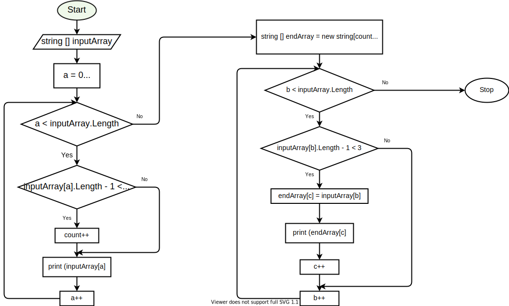

# **Итоговая проверочная работа.**

## **Написать программу, решающую поставленную задачу.**

## Задача. 
### Написать программу, которая из имеющегося массива строк формирует новый массив из строк, длина которых меньше, либо равна 3 символам. Первоначальный массив можно ввести с клавиатуры, либо задать на старте выполнения алгоритма. При решении не рекомендуется пользоваться коллекциями, лучше обойтись исключительно массивами.

### *Примеры:*

### [“Hello”, “2”, “world”, “:-)”] → [“2”, “:-)”]

[“1234”, “1567”, “-2”, “computer science”] → [“-2”]

[“Russia”, “Denmark”, “Kazan”] → []

## Решение.
### Программа для решения данной задачи, была написана с помощью двух циклов **while**.
### **Первый цикл** выводит элементы заданного массива и подсчитывает количество элементов, удовлетворяющих условию задачи.
### Далее создаётся новый массив, длиной (которая была высчитана ранее).
### **Вторым циклом** мы заполняем итоговый массив и выводим элементы этого массива.

## **Блок-схема программы.**

